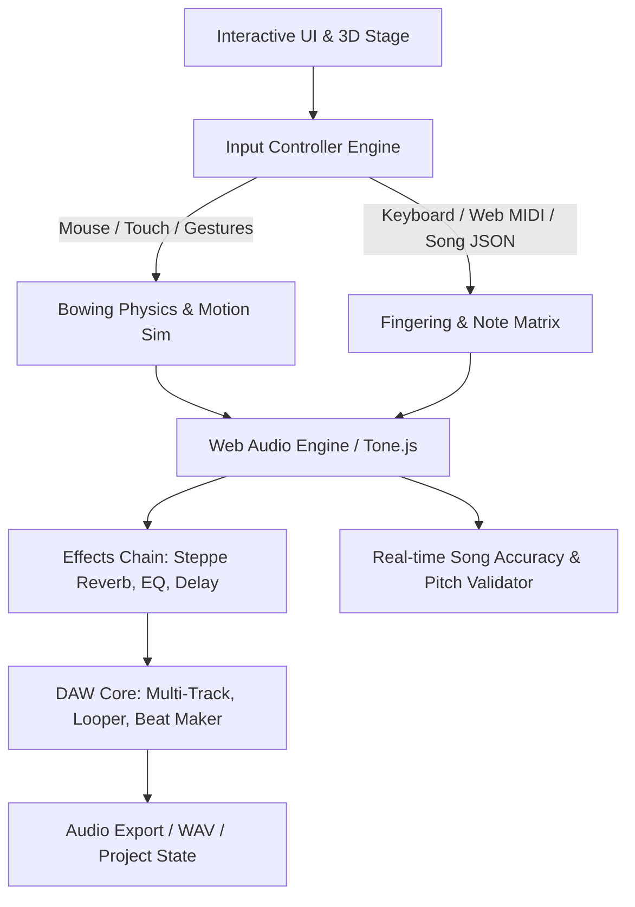

# Morin Khuur Simulator & Web DAW — Architecture & Project Plan

## 1. Executive Summary & Cultural Mission
The **Morin Khuur (Морин хуур) Simulator** is an interactive, browser-based instrument playground, automated song learning validator, and mini-DAW (GarageBand-style digital audio workstation). 

Preserving and sharing the oral and intangible cultural heritage of humanity (UNESCO), the simulator incorporates pedagogical and technical insights from master initiatives like **UUGUUL** ([uuguul.com](https://uuguul.com/learn/morin-khuur/)), preserving ancestral playing techniques, terminology, and repertoire for generations worldwide.

---

## 2. Pedagogical Framework & Authentic Playing Syllabus (Inspired by UUGUUL)

To ensure this simulator is a true pedagogical tool and not just a generic synth, the architecture implements the **9-stage progressive learning and technique curriculum**:

```
[Stage 1: Fundamentals & Tuning] ──► [Stage 2: Bow Grip & Stroke Dynamics] ──► [Stage 3: First Notes & Bii Scale]
                   │
                   ▼
[Stage 4: Bow Accents & Joroo]   ──► [Stage 5: Chichiree Vibrato]         ──► [Stage 6: Tsatsal Harmonics & Thumb]
                   │
                   ▼
[Stage 7: Glissando Variations]  ──► [Stage 8: Tsokhilgo Articulations]   ──► [Stage 9: Heritage Master Repertoire]
 (Gulsuulakh / Shuvtrakh / Shigshikh)  (Finger strikes, Col Legno hits)     (Tatlaga, Bii Biyelgee, Urtiin Duu)
```

### Detailed Technique Matrix:
1. **Stage 1: Instrument Anatomy & Acoustic Setup**:
   * Tuning options: Modern Standard **F3 - B♭3** (Arga & Bilag), Traditional Folk **C3 - G3** / **F3 - C4**.
   * Resonator acoustics: Trapezoidal soundbox, wolf note damping, sound post resonance.
2. **Stage 2: Underhand Bow Grip & Dynamics**:
   * Palm-up grip; middle and ring fingers flexing horsehair tension dynamically.
   * Basic strokes: **Tatakh** (Pull / Down-bow) and **Tülekhe** (Push / Up-bow).
3. **Stage 3: Side-Stopping & Bii Scale**:
   * Fretless neck: No fingerboard contact. Strings stopped from the side with cuticle/fingernail.
   * Pentatonic *Bii* scale mapping (for traditional *Bii biyelgee* dance tunes).
4. **Stage 4: Bow Accents & Galloping Metronome**:
   * Rhythmic accents for *Morin Joroo* (galloping horse trot in 6/8 and dotted 2/4).
5. **Stage 5: Chichiree (Vibrato)**:
   * Cuticle-rocking microtonal oscillation.
6. **Stage 6: Harmonics (*Tsatsal*) & Thumb Playing (*Erkhii darakh*)**:
   * Natural overtones at 1/2, 1/3, 1/4 nodes.
   * Thumb playing (*Erkhii darakh*) on the male string to reach extended intervals and high registers.
7. **Stage 7: Glissando & Microtonal Sliding Variations**:
   * **Gulsuulakh**: Smooth, lyrical legato sliding between notes.
   * **Shuvtrakh**: Rapid stripping / whipping slide across intervals.
   * **Shigshikh**: Trembling / trembling-pitch shake slide.
   * **Moriin Insee**: Horse whinny imitation.
8. **Stage 8: Tsokhilgo & Extended String Hits**:
   * **Tsokhilgo**: Distinct rhythmic finger striking against the string.
   * **Col Legno (*Numny modoor tsoxikh*)**: Striking the string with the wooden bow stick.
   * **Body Tapping (*Hairtsag tsoxikh*)**: Knuckle-tapping the soundboard.
9. **Stage 9: Intangible Heritage Repertoire Verification**:
   * **Tatlaga**: Narrative instrumental pieces describing legends and animal movements.
   * **Bii biyelgee**: Energetic Mongolian dance tunes (*Khoton Bii*, *Joroo Mori*).
   * **Urtiin Duu**: Mongolian Long Songs with intricate microtonal ornamentation.

---

## 3. UI Design Concepts & Visual References

UI mockups have been generated and saved to the project's [design_references/](./design_references/) folder:

### 3.1 Beat Maker & Producer Studio (`morin_khuur_beatmaker_ui.jpg`)
* **4x4 MPC-Style Performance Grid**:
  * Authentic 2-string technique pads: Col Legno, Body Tap, Pizzicato Pluck, Horse Whinny, Tsatsal Harmonics, Tremolo Flutter.
  * Modern fusion elements: 808 Sub-bass, Shamanic Mongolian frame drums (*Khets*), and wood claps.
* **Step Sequencer Timeline**:
  * Switchable between traditional 6/8 galloping swing (*Joroo*) and modern 4/4 hip-hop/trap.
* **Interactive 3D Visualizer**: Live wooden Morin Khuur responding to triggered pads.

### 3.2 Song Tester & Notation Learning Engine (`morin_khuur_song_tester_ui.jpg`)
* **Automated Song Testing**:
  * Repertoire selector: *"Ulemjiin Chanar"*, *"Joroo Mori - Galloping Horse"*, *"Eej Mini"*.
  * Auto-Test Play button verifying that inputted song notes produce 100% physically accurate finger positions and bow directions.
* **Dual Notation Display**:
  * Numbered musical notation (Jianpu) and Western staff notation with real-time scrolling cursor.
  * Pitch accuracy gauge (99% target tolerance).
* **Kinematic Feedback**:
  * Highlights side-cuticle contact on hovering strings.
  * Bow visualizer showing Tatakh, Tülekhe, Col Legno hits, and Tsatsal harmonics.

### 3.3 Studio DAW View (`morin_khuur_studio_ui.jpg`)
* **Multi-Track Arrangement Timeline**:
  * **Track 1**: Morin Khuur Lead (Solo)
  * **Track 2**: Morin Khuur Rhythm (Galloping accompaniment)
  * **Track 3**: Tovshuur Lute Accompaniment
  * **Track 4**: Khöömii Drone (Mongolian overtone throat singing generator)
* **Effects Rack**: Steppe Reverb, Ger Ambience, Vibrato Depth.

### 3.4 Performance Playground View (`morin_khuur_playground_ui.jpg`)
* Close-up interactive fiddle neck, real-time bow gesture pad, and cassette quick-record.

---

## 4. System Architecture & Tech Stack



### 4.1 Recommended Technology Stack
* **Framework**: React 18+ with Vite + TypeScript.
* **Styling & UI**: Tailwind CSS + Lucide Icons.
* **3D Visuals**: Three.js / React Three Fiber (R3F) matching the [Sketchfab 3D Model reference (68ee30b5)](https://sketchfab.com/3d-models/morin-khuur-68ee30b5a2ad4ec68389d73b42d46c7e).
* **Audio Engine**:
  * **Tone.js + Web Audio API**: Low-latency synthesis and multi-sample playback.
  * **Sampler Sound Bank**: Multi-velocity layers for sustain (Tatakh/Tülekhe), Col Legno, Body Tap, Tsatsal harmonics, Tsokhilgo strikes, and horse whinny.
* **Storage & Export**:
  * **IndexedDB** for local sessions and audio stems.
  * `audiobuffer-to-wav` / Web MediaRecorder for direct WAV export.

---

## 5. Development Roadmap & Milestones

| Phase | Milestone | Deliverables |
|---|---|---|
| **Phase 1** | **Foundation & Audio Engine** | Tone.js sampler architecture, multi-layer samples for 2-string techniques (sustain, staccato, col legno, body tap, harmonics, horse whinny). |
| **Phase 2** | **3D Instrument & Kinematics** | Three.js Morin Khuur model, side-stopping cuticle kinematics, Tatakh/Tülekhe bow gesture physics, and string vibration. |
| **Phase 3** | **Song Testing & Notation Engine** | JSON song schema parser (`.mkhuur.json`), Jianpu & staff notation display, automated song playback validator (*Ulemjiin Chanar*, *Joroo Mori*). |
| **Phase 4** | **Beat Maker & Multi-Track Studio** | 4x4 MPC pads, 16/32 step sequencer with 6/8 Joroo swing, multi-track recording, Khöömii drone accompaniment, Steppe reverb. |
| **Phase 5** | **Open-Source Release & Education** | UUGUUL syllabus integration, localization (Mongolian Cyrillic, Traditional Script, English), preset library, WAV export. |
