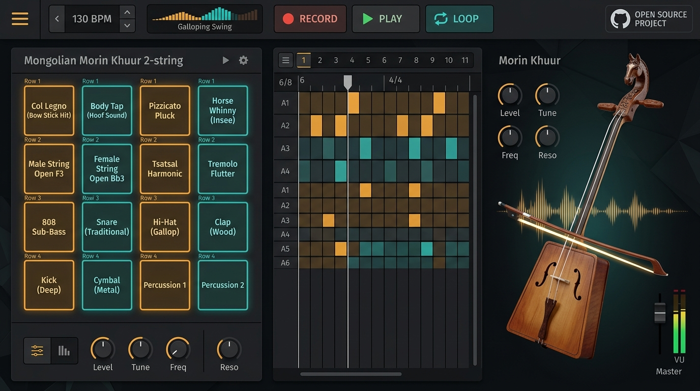
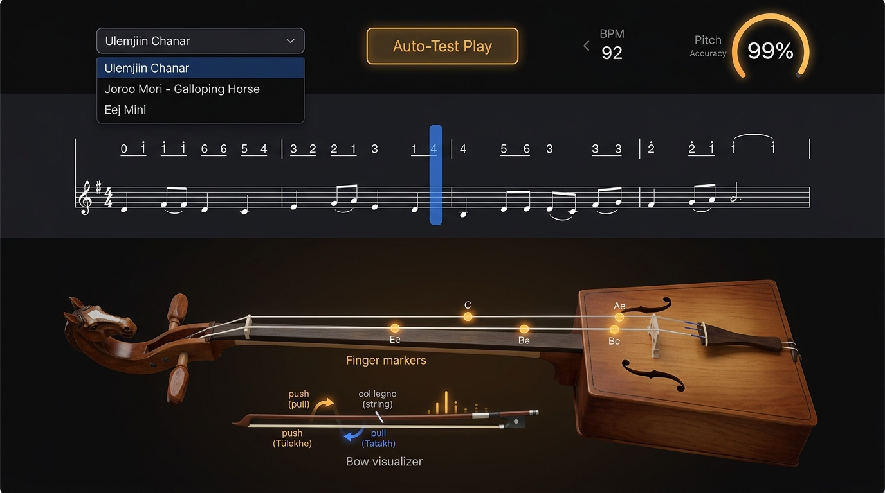
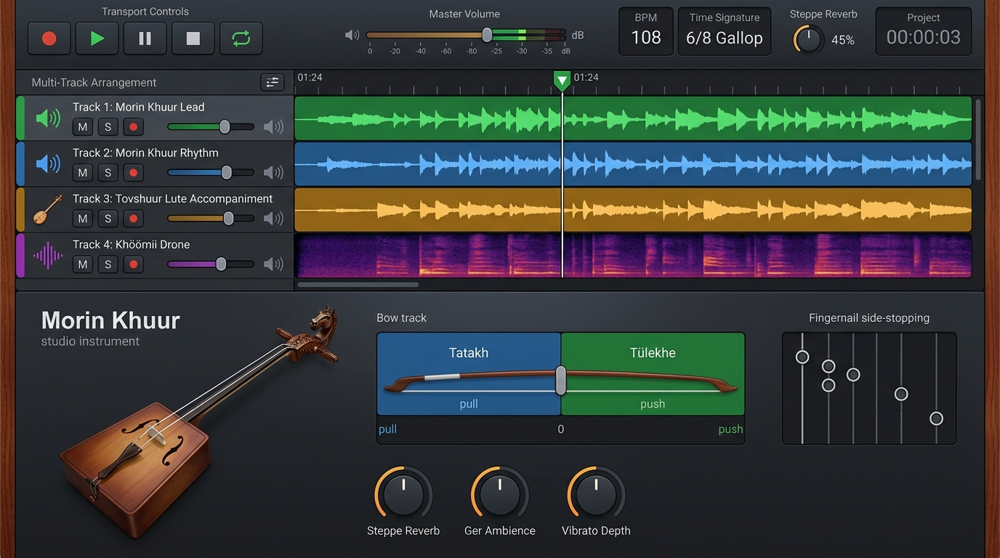
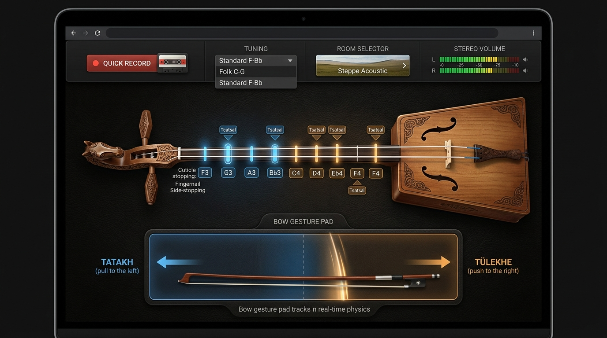

# Morin Khuur Simulator & Open-Source Cultural Heritage Project
*Морин хуурын онлайн симулятор ба дуу үйлдвэрлэлийн нээлттэй төсөл*

[](https://github.com/dokind/morin-khuur-simulator/actions/workflows/ci.yml)
[](https://github.com/dokind/morin-khuur-simulator/releases)
[](https://opensource.org/licenses/MIT)
[](https://ich.unesco.org/en/RL/traditional-music-of-the-morin-khuur-00068)
[](#-download--install-windows)

> **Our Mission:** To preserve, digitize, and share the authentic sound, playing techniques, and cultural heritage of the **Mongolian Morin Khuur (Horsehead Fiddle)** with the world through a free, open-source online instrument simulator, beat maker, and automated song learning engine.

---

## 📸 Design Blueprint & UI References

All design blueprints and UI mockups are available in the [`design_references/`](./design_references/) folder:

| Beat Maker & Producer Studio | Song Testing & Learning Engine |
|:---:|:---:|
|  |  |
| **Beat Maker Studio**: 4x4 MPC Pads for 2-string techniques (Col Legno, Body Tap, Horse Whinny, Pizzicato) + Galloping step sequencer. | **Song Tester & Notation Engine**: Automated song verification (*Ulemjiin Chanar*, *Joroo Mori*), sheet notation, side-fingernail tracking. |

| Multi-Track Studio DAW | Interactive Playground |
|:---:|:---:|
|  |  |
| **Multi-Track DAW**: GarageBand-style timeline with Lead, Rhythm, Tovshuur Lute, and Khöömii Throat Singing tracks. | **Performance Playground**: Close-up fiddle view with Tatakh (Pull) / Tülekhe (Push) bow pad and Steppe reverb. |

---

## 🐴 What Makes the Morin Khuur Unique? (2 Strings Mechanics)

The Morin Khuur does **not** have a traditional fingerboard. Strings hover freely in the air and are stopped from the **side** with the fingernails or cuticle groove.

Incorporating curriculum insights and authentic terminology from **UUGUUL** ([uuguul.com/learn/morin-khuur/](https://uuguul.com/learn/morin-khuur/)):

### Complete 20-Technique Spectrum:
1. **Col Legno (*Numny modoor tsoxikh*)**: Striking strings with the wooden stick of the bow for sharp, dry rhythmic clicks.
2. **Body Percussion (*Hairtsag tsoxikh*)**: Knocking the soundbox with knuckles to produce galloping horse-hoof rhythms (*doroo*).
3. **Horse Whinny Imitation (*Moriin insee*)**: High-register glissando with rapid flutter tremolo imitating a neighing horse.
4. **Natural Harmonics (*Tsatsal*)**: Bell-like overtones by lightly touching string nodes.
5. **Thumb Playing (*Erkhii darakh*)**: Under-string thumb hook for high-register intervals.
6. **Pizzicato (*Huruugaar tatakh*)**: Finger-plucked crisp attacks.
7. **Tatakh & Tülekhe**: Dynamic pulling (down-bow) and pushing (up-bow) expressions.
8. **Glissando Variations**: Smooth legato (*Gulsuulakh*), whipped slide (*Shuvtrakh*), and trembling slide (*Shigshikh*).
9. **Tsokhilgo Articulations**: Sharp finger strikes onto the string.
10. **Tremolo (*Dalallaga*) & Vibrato (*Chichiree*)**: Rapid bow shaking and cuticle rock vibrato.
11. **Double-Stop Drone**: Bowing both the male bass string (*Arga*) and female treble string (*Bilag*) simultaneously.
12. **Sul Ponticello & Sul Tasto**: Near bridge (raspy harmonics) vs near neck (flute-like warmth).

---

## 💻 Download & Install (Windows)

The simulator is a desktop app built with Electron. Download the latest Windows build from the **[Releases page](https://github.com/dokind/morin-khuur-simulator/releases)** (or build it yourself with `npm run dist:win`, see *Development* below):

| File | What it is |
|---|---|
| `MorinKhuurSimulator-Setup-<version>-x64.exe` | Installer for 64-bit Windows 10/11 (Start-menu and desktop shortcuts, uninstaller). An `-arm64` installer is built for Windows on ARM. |
| `MorinKhuurSimulator-Portable-<version>.exe` | Runs without installing — handy for school computer labs and USB sticks. |

The builds are not code-signed yet, so Windows SmartScreen shows *"Windows protected your PC"* the first time: click **More info → Run anyway**. Settings, patterns and imported songs are stored per user and survive updates.

## ✨ What's inside

* **Playground** — the two hovering strings with side-stop pads at their physically correct positions, *tsatsal* harmonic nodes (1/2, 1/3, 1/4, 1/5), a bow gesture pad (drag speed = loudness, height = hair pressure, finite bow length), double-stop drone, pizzicato, col legno, body taps, string slaps, *tsokhilgo* finger strikes, thumb playing (*erkhii darakh*), tremolo, vibrato and the horse whinny. Play with the mouse, the computer keyboard (home row) or a MIDI keyboard; quick-record to WAV.
* **Beat Maker** — 4×4 pads of fiddle techniques and percussion (808, khets frame drum, bells…), a step sequencer with galloping *Joroo* (6/8), *Töwöö* and swing grooves, live recording, and WAV/MIDI export.
* **Song Tester** — loads `.mkhuur.json` songs, shows numbered notation (jianpu) with string/finger/bow lanes and/or a treble staff, checks every note against the physics of the instrument (pitch reachable on the string, harmonics only on real nodes, one pitch per string, bow alternation, finger order) and then renders each note to measure its pitch (< 5 cents, spec §5.3) before playing it with finger markers. Imports MIDI (`.mid`, `.kar`, `.rmi`) and MusicXML (`.musicxml`, `.xml`, `.mxl` — e.g. a score downloaded from MuseScore) and arranges them for the instrument automatically: melody part, octave, string, finger and bow, with repeats, 1st/2nd endings and D.C./D.S. played as written.
  Songs play in a **playing style** that adds what players do but never write down, from Mongolian, Chinese, English and Russian sources and measured on a conservatory recording: *Khalkh stage* (composed pieces: fixed rhythm, lyrical 5 Hz vibrato, few ornaments), *Long song (urtiin duu)* (tsokhilt vibrato, third-trills, graces, falls, shurankhai, rubato, a khuur prelude), *Tatlaga* (om zee opening, accent-release bowing, hammered ornaments, drone), *Bii / ikel*, *Inner Mongolian* (matouqin practice) — or *As written*. Ornaments use the tune's own pentatonic notes, never a semitone the melody does not use.
* **Playlist** — popular morin khuur pieces and hits (Jonon Khar, Ertnii Saikhan, Uyakhan Zambuu, Wan Ma Benteng, The HU…) with links to original performances. Play ours (one or all), load your own copy of the original recording to switch A/B between it and ours, run an automatic comparison (vibrato, harmonics, brightness, bow noise, attack, slides, tempo, key, melody), take a blind listening test, and export your notes. Copyrighted pieces are never bundled: import a score you are allowed to use and it links to its entry.
* **Studio** — a four-track arrangement (Lead, galloping Rhythm, Tovshuur lute, Khöömii drone with whistled overtones), mixer with mute/solo, *Steppe Reverb* / *Ger Ambience*, recording a lead take from the keyboard, and WAV mix export.

All sound is synthesised live from a physical model — a bowed horsehair-string waveguide and a modal soundbox — no samples yet. Recordings from players are very welcome.

## 🛠 Development

Requires [Node.js](https://nodejs.org/) 22.12+ (24 recommended) and Git.

```bash
git clone https://github.com/dokind/morin-khuur-simulator.git
cd morin-khuur-simulator
npm install          # first run also downloads Electron
npm run dev          # start the app with hot reload
npm test             # unit tests (domain model, notation, verification, importers)
npm run lint
npm run dist:win     # build the Windows installer + portable exe into dist/
```

`npm run dev:web` serves the interface in a normal browser at http://localhost:5173 for quick UI work. Architecture notes for contributors live in [CLAUDE.md](./CLAUDE.md).

### Contributing songs

Songs are plain JSON files in [`songs/`](./songs/) using the `.mkhuur.json` format from [the specification](./MORIN_KHUUR_FOUNDATION_SPEC.md#52-notation-format-specification-mkhuurjson). Every bundled song must pass the verifier without warnings (`npm test` checks this). Please fill in `source` with where the transcription comes from, and only contribute music you have the right to share. The songs currently bundled are original etudes written for this project; transcriptions of traditional pieces such as *Ulemjiin Chanar* or *Joroo Mori* made or checked by musicians are the most wanted contribution.

---

## 📚 Documentation
* 📖 [**MORIN_KHUUR_FOUNDATION_SPEC.md**](./MORIN_KHUUR_FOUNDATION_SPEC.md): Complete technical specification, acoustics, extended techniques, and open JSON song format.
* 📋 [**MORIN_KHUUR_SIMULATOR_PLAN.md**](./MORIN_KHUUR_SIMULATOR_PLAN.md): Multi-phase implementation roadmap and architecture.
* 🎨 [**design_references/**](./design_references/): High-resolution visual UI mockups.
* 🤖 [**CLAUDE.md**](./CLAUDE.md): Architecture, commands and domain gotchas for contributors.

---

## 🤝 Open Source & Cultural Contribution
This project is dedicated to the preservation of Mongolian traditional art and music. We invite musicians, developers, 3D artists, and cultural researchers worldwide to contribute traditional songs, audio samples, and code.
